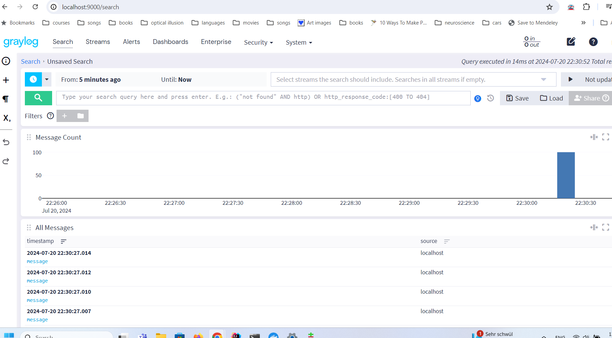
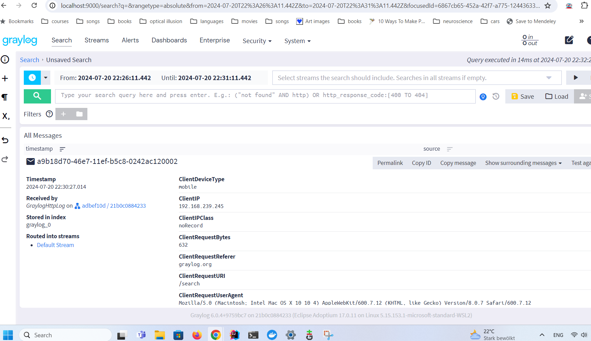

Graylog-task

The project is a CLI tools that reads a log file and validates it with a json schema then logs the data to graylog server.


For the project to log correctly, make sure that graylog docker is up[https://github.com/lawrencesystems/graylog?tab=readme-ov-file] and gelf http input is enabled and uses port[12201].
Then run App class with arguments:<br/>
-f/--file $AbsoluteFilePath


<b>Assumptions:</b>
<li>The sample file reflects the correct schema[sample-messages.txt] and all fields are required.</li>
<li>The files that will be processed are small and can fit in memory. If that's not the case, Another approach should be used. For example, reading the file line by line using BufferedFileReader.</li>
<li>There is no time constraint. If the application is slow, other approaches can be used. For example, using threads and bulk sending the messages to the server.</li>

This is how the message appear on the search page[http://localhost:9000/search]<br/>
<br/>
This is how the fields look

The schema that the input files must fulfill:<br/>
```json
{
"$schema": "http://json-schema.org/draft-04/schema#",
"type": "object",
"properties": {
"ClientDeviceType": {
"type": "string"
},
"ClientIP": {
"type": "string"
},
"ClientIPClass": {
"type": "string"
},
"ClientStatus": {
"type": "integer"
},
"ClientRequestBytes": {
"type": "integer"
},
"ClientRequestReferer": {
"type": "string"
},
"ClientRequestURI": {
"type": "string"
},
"ClientRequestUserAgent": {
"type": "string"
},
"ClientSrcPort": {
"type": "integer"
},
"EdgeServerIP": {
"type": "string"
},
"EdgeStartTimestamp": {
"type": "integer"
},
"DestinationIP": {
"type": "string"
},
"OriginResponseBytes": {
"type": "integer"
},
"OriginResponseTime": {
"type": "integer"
}
},
"required": [
"ClientDeviceType",
"ClientIP",
"ClientIPClass",
"ClientStatus",
"ClientRequestBytes",
"ClientRequestReferer",
"ClientRequestURI",
"ClientRequestUserAgent",
"ClientSrcPort",
"EdgeServerIP",
"EdgeStartTimestamp",
"DestinationIP",
"OriginResponseBytes",
"OriginResponseTime"
]
}
```